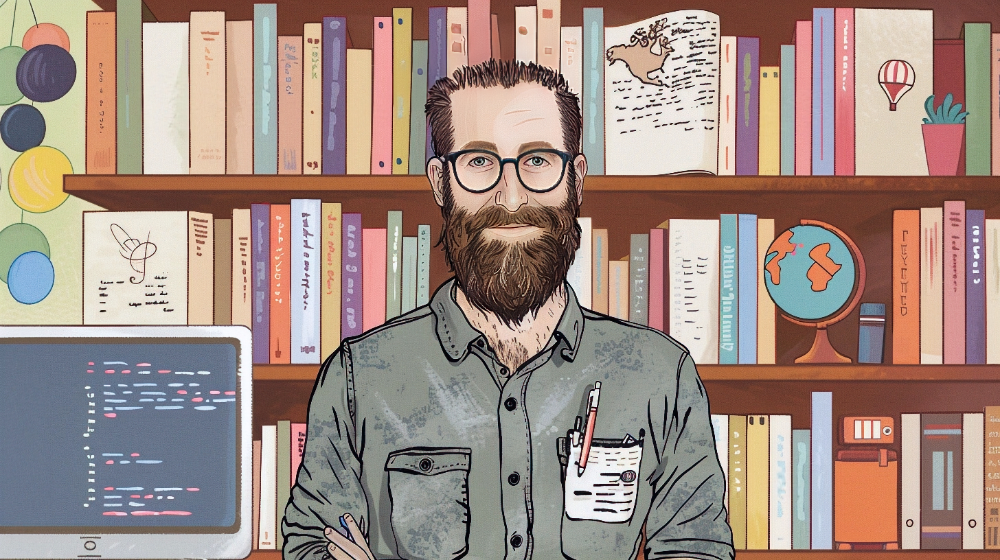

---

## 🧔 About Me
Hey there! I'm a developer with a twist. While my educational roots lie in Librarianship and Information Sciences —yeah, you heard that right, I come from a humanities background— I've spent the last 20 years crafting a career in software development. My specialty? Import/export, data analysis & transformation, and breathing new life into legacy code by refactoring it for the modern age.

A significant portion of my expertise lies in data interchange between various file formats such as CSV, TSV, fixed-length plain text files, JSON, XML, and similar formats, as well as relational databases. I excel at analyzing both the source and target data structures to understand the data flow and transformations required. However, my true focus is on understanding the ultimate objective and the end user's needs. By gaining a deep understanding of the purpose behind the data interchange and the desired outcomes, I can design and implement solutions that not only handle the technical aspects of data conversion and integration but also provide meaningful insights and value to the end users. This holistic approach allows me to deliver solutions that go beyond mere data manipulation and contribute to the overall success of the project and the satisfaction of the stakeholders.

- 📚 **Educational Background**: Degree in Librarianship and Information Sciences (Humanities)
- 🏢 **Work**: [Educaria](https://www.educaria.com)
- ⚙️ **Tech Stack**: `C#`, `.NET`, `JavaScript`, `Python`, `HTML`, `CSS`, `Java`, `Perl`
- 🌱 **Interest**: `Open Source`, `Photography`, `Nature`
- 💼 **Expertise**: `Import/Export`, `Data Analysis & Transformation`, `Code Refactoring`
- 💬 **Hit me up about**: `Web Dev`, `Design Thinking`, `Music`, `Coffee`, `Photography`

---

## 📸 Amateur Photography

When I'm not immersed in the world of code, you'll often find me behind the lens of my camera. As an amateur photographer, I've discovered that photography is not just a hobby but a way to quiet my mind and tap into my creative side. It's a refreshing break from the analytical nature of my work in software development.

Through photography, I'm learning to explore my artistic skills and see the world from new perspectives. I've come to appreciate that not every shot has to be perfect. Even blurred or trepidated photos can have their own unique charm and beauty. It's all about capturing moments, experimenting with different techniques, and most importantly, having fun along the way.

Photography has taught me valuable lessons about patience, observation, and the power of perspective. It's a continuous journey of growth and self-discovery, and I'm excited to see where this creative outlet takes me next.

<table>
  <tr>
    <td>
      
    </td>
    <td>
      
    </td>
    <td>
      
    </td>
  </tr>
<tr>
    <td>
      
    </td>
    <td>
      
    </td>
    <td>
      
    </td>
  </tr>

</table>

---

## 📝 Writing Passion

I've been writing all kinds of short stories and microfiction since I was a child. Writing has always been a true passion of mine, allowing me to express my creativity and imagination. However, I'm currently experiencing a bit of a writing block. To overcome this and keep my writing spirit alive, I've decided to repost some of my favorite posts from my now-defunct blog on my Substack. It's a way for me to revisit my past works, share them with a new audience, and hopefully reignite my writing spark. Feel free to check out my Substack, [Stories Along the Way](https://ignaciodemigueldaz.substack.com/), to explore my fictional microstories and stories.

---

## 🧰 Skills

  

    <h3> 🗨️ Languages </h3>
  

  
  - [ C#](https://docs.microsoft.com/en-us/dotnet/csharp/)
  - [ .NET](https://dotnet.microsoft.com/)
  - [ Python](https://www.python.org/)
  - [ JavaScript](https://developer.mozilla.org/en-US/docs/Web/JavaScript)
  - [ Java](https://www.oracle.com/java/)
  - [ Perl](https://www.perl.org/)

  

    <h3> 🛠️ Frameworks & Libraries</h3>
  

  
  - 🌐 [.NET Core](https://dotnet.microsoft.com/)
  - 🌐 [ASP.NET](https://dotnet.microsoft.com/apps/aspnet)
  - ⚛️ [React](https://reactjs.org/)
  - 🌶️ [Flask](https://flask.palletsprojects.com/)

  

    <h3> 🛠️ Tools & Platforms</h3>
  

  
  - [Git](https://git-scm.com/): 📦 Version Control
  - [GitHub](https://github.com/): 🌐 Collaboration
  - [Linux](https://www.linux.org/): 🐧 OS
  - [VS Code](https://code.visualstudio.com/): 📝 Editor
  - [Windows](https://www.microsoft.com/en-us/windows): 🪟 OS

---

## 📈 GitHub Stats

  
  
  

---

  

  

---

## 🤝 Let's Connect

  
  
  
  
  

